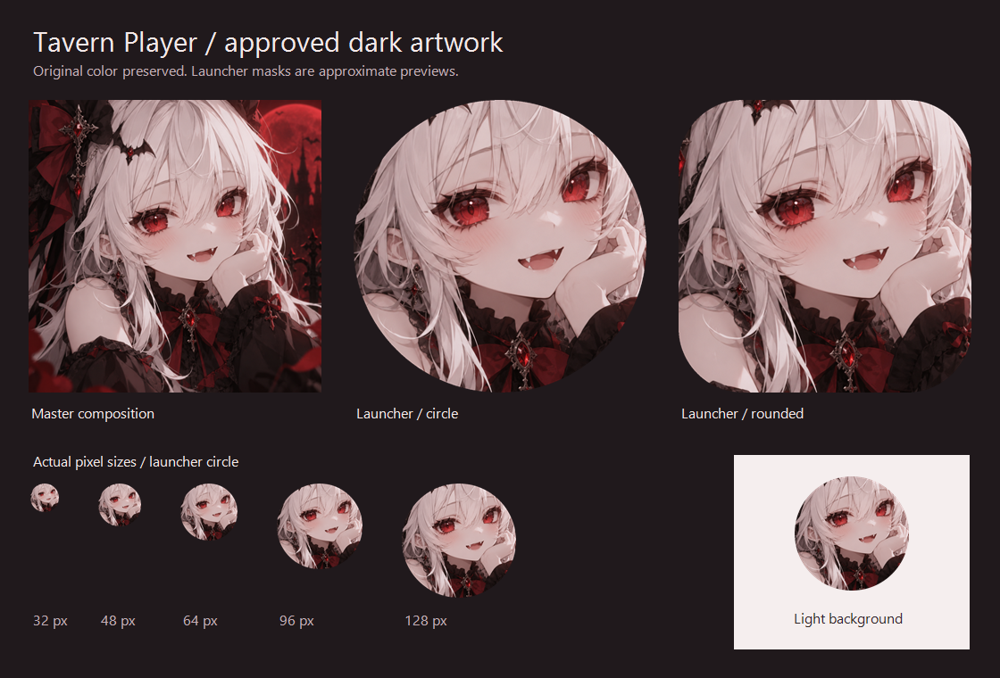

# Tavern Player artwork resources

本套资源使用 2026-09-16 用户选定的暗色人物原图：白发、红瞳、黑红服饰。保留原色调、表情、饰品和背景，仅做尺寸导出与遮罩裁切；没有重新生成或重绘人物。



## 文件与用途

| 路径 | 用途 |
| --- | --- |
| `master/mascot-dark-v1.png` | 1254 × 1254 原图，按原始字节保留，后续导出的唯一来源 |
| `exports/avatar-square-{1024,512,256,128,64}.png` | 完整构图的方形头像，无预制圆角，适合项目头像和资料展示 |
| `exports/avatar-circle-{512,256,128}.png` | 完整构图的圆形头像，四角透明，适合直接放入宣传素材 |
| `previews/launcher-{circle,rounded}-512.png` | 桌面图标构图预览，四角透明，仅供查看，不用于 Android 图标图层 |
| `previews/contact-sheet.png` | 原图、两种图标遮罩、32–128 px 缩略图和浅色背景对比 |
| `../../app/src/main/res/mipmap-*/ic_launcher_artwork.png` | Android 自适应图标彩色图层，108/162/216/324/432 px 五档密度 |

原图 SHA-256：`d53ff73b424f409bb5fffb50c87c87c9849a1a7798b68a6b5ad32221fed905b4`。

## Android 接入

Manifest 使用 `@mipmap/ic_launcher`，自适应图标定义位于 `mipmap-anydpi-v26/ic_launcher.xml`。当前 minSdk 为 26，无需旧版系统的位图回退入口。圆形与其他形状由启动器遮罩同一个自适应资源，不额外维护不同人物构图的 `roundIcon`。

根据 [Android 自适应图标规范](https://developer.android.com/develop/ui/compose/system/icon_design_adaptive)，图层使用 108 dp 画布，预览模拟居中的 72 dp 可视区域，面部作为中央重点。因此桌面图标比完整头像更靠近脸部，外围蝴蝶结和服饰可能被裁切。预览中的圆角形状只是示意，不承诺所有启动器采用相同遮罩。

当前前景层是包含原画背景的完整不透明位图，底层为 `#20191C`；未将人物抠图拆层，也不提供人物与场景独立移动效果。没有手工制作单色主题图层；主题图标的实际表现由系统和启动器决定，彩色图标是本轮交付目标。

UI 配色、聊天界面和应用内头像不随这套资源改动。

## 重新导出

在 Windows 仓库根目录执行，无需图像生成服务或凭据：

```powershell
./tools/branding/export-assets.ps1
```

脚本使用系统 `System.Drawing`，仅覆写本套派生文件，不修改 master。所有导出以 master 为来源，避免多次缩放；圆形遮罩使用超采样保留平滑透明边缘。导出后检查 `previews/contact-sheet.png`，并执行：

```powershell
./gradlew.bat :app:processDebugResources
```

资源编译不能代替设备验证。发布前需在实际启动器中核对圆形、圆角、主题图标及系统启动画面的裁切效果。
