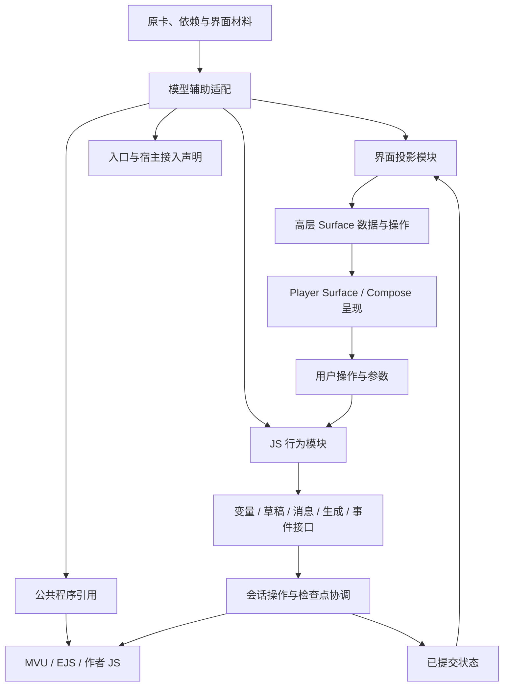

# 原生适配方案研究：界面投影、JS 行为与宿主接入

> 归档说明（2026-09-09）：保留阶段设计、源码审计与验证证据；文中的“当前”“下一步”和版本号指记录当时，不作为现行产品决策或完整运行契约。现行入口见[文档导航](../README.md)、[产品边界](../product-direction.md)和[实现架构](../architecture.md)。

日期：2026-09-08。状态：方案已获用户采纳，首轮实现见 [JS 动态原生 Surface](native-script-surfaces-20260908.md)。本文保留整体研究提案，概念 API 不等于已实现 API，具体差异以实现说明为准。

本文接续 [路线研究](native-adaptation-research-20260908.md)，吸收用户对“公共运行机制减负、模型负责自定义 JS/UI 重构”的反馈，开始收敛到可以制作原型和比较的方案。

## 1. 首选方案

**模型生成面向高层 Native Surface 的动态数据投影、可执行 JS 行为模块和宿主接入声明；Player 负责 Surface 的视觉设计、公共运行时、操作提交与恢复。**

原则是：**开放程序表达，收紧界面表达。** JS 可以承担必要的语义理解结果、条件、循环和异步行为；界面优先使用受控、可持续扩展的高层 Surface，通用组件树不作为首选基础设施。

这允许模型保留函数、抽取闭包、重写 DOM 交互、生成适配代码，也允许原有 MVU/EJS 程序继续执行。不要求所有作者 JS 原封不动，更不要求把所有分支和异步流程翻译成 JSON 操作码。

初步结构如下：



这是一种可编程内容运行结构，有真实维护成本。程序表达能力的扩大不要求界面获得同等自由度：模型决定内容和行为，Player 通过高层 Surface 维护视觉与交互体验。是否增加新的 Surface 或宿主接口，要用真实样本验证。

### 首选与备选

| 决策 | 首选 | 备选及切换条件 |
| --- | --- | --- |
| 动态显示 | JS 根据快照返回受控高层 Native Surface 的数据与操作 | 大列表成本过高时，研究同一 Surface 内的分页或增量数据；表达不足先考虑新增高层 Surface |
| 自定义行为 | JS 模块，复用公共程序，允许局部重构 | DOM/闭包提取失败时，局部 Web 或更宽的源宿主适配 |
| 执行实例 | 单次行为调用拥有实例，跨调用状态显式保存 | 原程序难以显式化时，研究长寿命实例及状态导出 |
| 模型流程 | 一次生成作为基线，校验后按失败原因决定后续 | 复杂跨脚本语义或需要运行信息时增加分析/修正步骤 |
| 历史归属 | 状态检查点可由消息或操作产生 | 对极少数简单操作沿用既有选择提交，但不据此承载所有交互 |

高层 Surface 优先是本方案明确的界面设计原则；其余执行策略仍需实验验证。通用布局能力的后续研究条件见第 4.2 节。

## 2. 本轮新增核查与实际基础

### 2.1 已有库能提供什么

仓库依赖 `quickjs-kt:1.0.10`。核对该版本文档，它已提供 ES module、模块加载、Kotlin 异步函数到 JS 的桥接以及取消相关机制。因此自定义模块和异步宿主调用有库级基础，无须先更换 JS 引擎。[quickjs-kt v1.0.10](https://raw.githubusercontent.com/dokar3/quickjs-kt/v1.0.10/README.md)

这只证明库提供机制，不代表 Player 已把模型生成、消息操作和变量修改封装为这些桥。模块加载回调的同步性、取消时的资源回收、等待网络时的超时行为，都应针对本项目用法验证。

### 2.2 MVU 写入入口必须区分

本轮检查了本地锁定源码 `update_variables.ts` 和 `variable_def.ts`，并以 SHA-256 核对其与 `upstream-lock.json` 一致。

当前导出的 `updateVariables` 接受消息文字和 MVU 数据，内部解析命令，发出多个更新事件，再进行后续处理。它不是“输入任意对象就执行标准写入”的通用函数。[锁定 MVU 实现](https://raw.githubusercontent.com/MagicalAstrogy/MagVarUpdate/61010dab47bc3a08a1b626320bf7fc8c9573eca4/src/function/update_variables.ts)

因此不能只增加一个 `setState(path, value)`，就宣称所有作者写入都经过相同 MVU 语义。必须区分：

- 作者要求按 MVU 消息协议解析更新；
- 作者直接替换或修改消息变量；
- 作者在某个 MVU 事件内修改传入对象；
- 作者调用其他框架自己的更新入口。

宿主应该保存这种差异。直接变量替换是否运行 Schema、触发哪些回调，必须依据所选接口的真实语义，不额外添加“看起来更正确”的步骤。

### 2.3 当前会话的提交单位主要是消息候选

`MessageVariant` 保存处理前后的 Runtime，另有用途有限的 `playerChoiceCommits`；普通聊天在完整回复结束后应用 MVU，并保存 `runtimeStateAfter`。

这说明纯展示和草稿生成可以较小改动接入；能独立修改状态、等待生成、追加消息的作者操作，会触及会话提交与恢复，不只是调整编译 prompt。

源码入口见 [ConversationModels.kt](../../conversation-core/src/main/kotlin/io/github/zvensmoluya/tavernplayer/conversation/ConversationModels.kt)、[ChatViewModel.kt](../../app/src/main/java/io/github/zvensmoluya/tavernplayer/conversation/ChatViewModel.kt)。

### 2.4 与旧设计文件的关系

2026-09-03 的设计原则及 Domain Operations 草案曾明确排除通用组件树、回调与任意程序。当前提案开放 JS 行为表达，同时保留 Player 通过高层 Surface 接管视觉设计的方向。程序能力与界面能力分别讨论，不因开放 JS 就默认引入通用组件树；也不据此声称产品实现已经改变。

如果方案采纳，需要同步修订旧文档，不应让相反的“当前方向”长期并存。

## 3. 编译产物：六部分足够表达首选方案

以下是概念结构，名称和字段未定版，不能直接作为当前导入文件使用。

| 部分 | 内容 | 谁提供或确认 |
| --- | --- | --- |
| `sourceBindings` | 原程序、模板、资产的稳定引用 | 模型选择，本地核对原件和哈希 |
| `runtimePrograms` | 公共 MVU/EJS、保留 JS、改写 JS 模块及依赖 | 原件恢复或模型生成，本地加载验证 |
| `surfaces` | 高层 Surface 类型、显示入口及其数据投影 | 模型选择内容与操作，Player 的 Surface 实现负责视觉设计 |
| `handlers` | 用户操作和生命周期入口对应的模块导出 | 模型声明，本地验证引用及输入 |
| `stateDeclarations` | 原状态归属、显式程序状态及 UI 状态 | 模型依据源码提出，本地保存对应空间 |
| `evidence` | 来源、转换方式、探测上下文、差异与未决项 | 编译器和验证器记录，模型补充语义说明 |

关键是把三个事实分别表达：引用原码、转换原码、由 Player 提供。不能把模型重写的模块标成“原程序已保留”；也不能只对新源码计算哈希，就当作转换得到验证。

每个生成模块应带来源关联和转换说明，例如“把 DOM 点击监听移为 `buy` 导出；保留价格计算函数；将 `owned` class 映射为 UI 标志”。模型提供的源码位置只是待核查引用；若改写范围较大，不应伪造精确逐行对应。

### 3.1 产物声明所需能力，不自动创造能力

模块可以声明需要变量读取、变量替换、辅助生成或某事件。编译器必须区分当前可用、实验实现和缺失能力。

若模型提出一个当前不存在的操作，该功能保留为待实现需求或另选转换方案，不能仅因为名称写在 manifest 中就认为可以执行。能力缺口与模型生成错误应产生不同诊断。

### 3.2 模型仍需看到作者的完整相关程序

公共 MVU/EJS 的已知机制可用版本说明减少重复解释，但原卡 Schema、回调、EJS 使用方式和未知依赖仍可能影响界面与操作。

本地索引负责辅助定位，不把“识别到了哪些固定模式”变成输入白名单。未知部分要能继续进入模型分析；公共库指纹匹配成功也不能掩盖同一脚本中附带的作者代码。

## 4. 原生 UI 怎样表达动态行为

### 4.1 首选：JS 计算，高层 Native Surface 承载结果

首选方案不以任意原生组件树作为角色卡界面的默认表达方式。

模型负责理解原界面、作者脚本和交互语义，并通过 JS 动态计算当前应显示的数据、状态、可用操作和内容结构；Player 使用一组受控、可持续扩展的高层 Native Surface 呈现这些结果。

优先表达为：

- Status：角色状态、属性和派生信息。
- Collection：背包、商店、任务、人物等重复条目。
- Form：结构化输入和选择。
- Scene：场景及相关信息。
- Action Group：当前可执行操作。
- 后续根据真实样本增加的专用 Surface。

这是一组方案层的 Surface 分类；动态操作、Action Group 等仍需定义和实现，不能视为当前版本已经提供的能力。

模型主要决定“显示什么、当前状态是什么、有哪些操作、操作连接哪个 handler”，而不是自行决定任意 Row、Column、Spacer、Padding 等底层布局细节。视觉层级、间距、响应式布局、交互反馈和无障碍行为由 Player 的 Surface 实现统一维护。

`present(context)` 仍可执行必要的条件、循环、派生计算和数据整理，首选输出是已有 Surface 的数据模型。例如：

```js
export function present(context) {
  return {
    surface: 'collection',
    key: 'shop',
    title: '商店',
    items: Object.entries(context.state.shop.items).map(([id, item]) => ({
      key: id,
      title: item.title,
      description: item.description ?? '',
      status: item.owned ? 'owned' : 'available',
      actions: item.owned
        ? []
        : [{
            id: 'buy', label: '购买', handler: 'buy',
            args: { itemId: id }
          }]
    }))
  };
}
```

这是人为编写的说明性例子，不是模型实验结果，也不是现有 API。循环、条件、派生文字由 JS 计算；跨桥传递 Collection 的条目、展示状态与操作引用，不包含任意嵌套的布局节点。示例状态值也属于待定义的 Surface 契约，不表示所有 Collection 都必须使用购买状态。

这样不必同时维护 JS 和一套包含 `if/for/map/await` 的 JSON 表达式语言。字段绑定的简写可以保留，但没有必要让每一种派生计算都扩成新的 DSL 运算符。

Surface 数据模型仍是有版本的界面协议。Player 定义语义字段、输入事件、稳定条目标识及视觉行为，模型在这些能力内组织内容与交互。JS 保留程序表达能力，Player 保留界面设计权。

### 4.2 先扩 Surface，再评估通用布局的必要性

已有 Status、Collection、Form 等 View 是首选方案的起点，不只是通用组件树之上的可选快捷方式。若采用 ItemTemplate，它应描述 Surface 支持的语义字段和操作位置，不能成为任意布局节点的嵌套入口。列表分页或增量数据属于同一 Surface 的运行优化，不要求引入通用树。

若真实样本持续出现现有 Surface 无法合理表达的重要交互，应首先判断是否值得增加新的高层 Surface。只有样本证明高层 Surface 会造成明显且普遍的表达障碍时，才研究有限的通用布局节点或更自由的组件树。

**通用组件树不是首个原型的前置能力，也不作为复杂界面的自动兜底。** 它是需要真实样本证明必要性的后续扩展。

Remote DOM 的跨环境组件与事件同步可作为后续研究参考，不作为当前方案的默认依赖或建设目标。[Remote DOM core](https://raw.githubusercontent.com/Shopify/remote-dom/main/packages/core/README.md)

### 4.3 显示计算与操作执行分开提供宿主能力

`present` 接收确定版本的业务快照、UI 输入和显式程序状态。首选让显示环境不具备持久写入和生成请求接口，防止 Compose 重组或列表滚动重复触发操作。

这不是禁止作者的“显示后自动执行”行为。若源码确实在首次显示时触发业务操作，适配应将其显式连接到相应生命周期，记录何时触发及是否重复。不能为了让显示函数纯化而删除效果。

模块顶层同样可能有副作用，不能仅靠 `present` 的函数名保证只读；探测和运行环境都要限制实际暴露的接口。初始化注册与业务执行需要有可区分的入口。

### 4.4 业务状态、UI 状态和程序私有状态

| 状态 | 例子 | 首选归属 |
| --- | --- | --- |
| 业务状态 | 物品、好感度、购买结果 | 原状态系统或明确的 Player 会话状态 |
| UI 状态 | 页签、展开项、未提交输入 | surface 实例的状态；是否恢复按具体交互选择 |
| 程序私有状态 | 原闭包计数、已触发事件标志 | 显式声明作用域的脚本状态，必要时随检查点保存 |
| 执行状态 | 请求中、取消中、失败信息 | 操作协调器；不能伪装成剧情事实 |

DOM class 可能属于上述任意一项。模型应通过读写关系判断，而不是把所有 class 都提升成业务变量。

## 5. JS 如何调用 Player

### 5.1 操作入口

原生界面发送的是结构化调用：

```text
surfaceInstance + renderedRevision + handlerId + args + userInput
```

`handlerId` 对应包里已声明的导出函数，不能把界面字符串当作任意 JS 执行。参数来自 Surface 操作绑定和用户输入，实际执行前还要依据当前状态检查前置条件；按钮隐藏或禁用不是业务验证。

历史面板读取历史快照，当前操作读取当前有效检查点。旧界面点击携带的版本若已过期，应重新计算可操作性，而不是沿用旧余额、旧物品或旧分支。

### 5.2 宿主接口按效果区分

以下为需要明确语义的接口家族，不是声明现在全部可用：

| 家族 | 必须描述的内容 | 当前基础与缺口 |
| --- | --- | --- |
| 变量读取 | 状态系统、作用域、消息目标、复制语义 | 已有检查点与只读绑定，可复用 |
| 变量修改 | 替换/合并/协议更新、Schema 和回调、提交点 | 有 MVU 内部链路；缺少通用作者操作入口 |
| 草稿 | 设置/插入、是否覆盖现有输入、目标会话 | 已有草稿行为，可抽出入口 |
| 消息 | 创建/修改/隐藏等效果、候选与历史关系 | 有用户编辑等流程；不能直接当脚本 API |
| 生成 | 提示词来源、预设、是否进入历史、是否解析 MVU | 已有模型协议客户端；缺少统一作者调用编排 |
| 事件 | 发出位置、参数、等待、顺序、卸载、重入 | MVU 有局部事件；不等于完整酒馆事件 |
| 资源 | 资源身份、加载来源、返回类型 | 本地资产已有；其他资源需按需求设计 |

### 5.3 原接口 shim 与 Player 接口可以并存

公共程序可以使用经过验证的兼容 shim。模型改写后的代码可直接使用 Player 接口。一个原接口无法保持全部语义时，不宜用相同名称提供近似行为却不说明。

尤其不能让 `generate` 同时隐式承担“返回辅助文字”“自动写入聊天”“解析 MVU 更新”三种行为。应由接入声明说明调用的效果，避免结果被重复解析、重复加入历史。

对反馈中的购买示例，原 `generate({prompt: ...})` 只能作为意图示例；实际接入需核对所用上游版本的参数和返回行为，不能把示意代码当作已核实的 API 签名。

## 6. 完整例子：购买后请求描述

选用一个中性构造行为：原界面读取商品，已购买则退出；否则请求一段描述，成功后保存购买结果并更新显示。不额外发明扣款规则、物品效果或聊天消息。

### 6.1 概念适配代码

```js
export async function buy(ctx, { itemId }) {
  const before = await ctx.variables.read('shop');
  if (before.items[itemId]?.owned) return;

  const text = await ctx.generation.text({
    profile: 'purchase_description',
    input: { itemId }
  });

  const next = structuredClone(before);
  next.items[itemId] = {
    ...next.items[itemId], owned: true, description: text
  };
  await ctx.variables.replace('shop', next);
}
```

这些函数是候选接口记法，`structuredClone` 也需由目标环境或构建工具提供，不能假定当前 QuickJS 已暴露它。`shop` 是显式绑定到原作用域的别名，不是让模型随意新建一份背包。

若原程序用替换而非合并，适配不能擅自保留原来会被删除的字段；若原程序在网络返回后重读变量，则要保留该行为。本例只说明一条已定义语义，不能当通用购买模板。

### 6.2 一次成功执行

1. 点击绑定到当前 head `H0`，协调器创建操作 `A`，保存调用参数与包版本。
2. 执行 `buy`，变量读取绑定到 `A` 的有效状态。
3. 生成桥记录请求身份和必要的上下文，等待结果；网络等待不持有数据库提交锁。
4. 返回文字时检查 `A` 是否仍有效。未取消、未切换到其他分支，才继续 JS。
5. 替换请求按声明的原变量语义生成下一状态；保存成功后产生 `H1`，再向 JS 返回成功。
6. 界面依据 `H1` 重新投影，显示已购买及描述。

这里的 `H0/H1` 是状态检查点标识。辅助文字是否进入聊天由源码决定，本例没有自动生成 assistant 消息。

### 6.3 失败和取消

| 情况 | 本例应发生什么 |
| --- | --- |
| 模型请求失败 | 没有购买状态提交，显示操作失败 |
| 请求期间取消 | 调用失效；迟到结果不能写入当前状态 |
| 请求期间切换候选 | 旧操作不向新候选提交；是否保留可查看结果是产品选择 |
| 状态落盘失败 | 不发布“已购买”的成功状态，不仅更新内存 |
| 重复投递同一操作 ID | 已提交则返回已有结果，不重复写入 |
| 进程在请求发出后退出 | 记录为中断或外部结果未知，不自动重发后宣称只请求过一次 |

不能承诺远端生成请求严格只发生一次：本地记录无法消除“请求已经被服务端接受，但本地尚未收到结果”的窗口。重复提交去重与远端请求去重是两件事。

### 6.4 原程序先写状态再请求怎么办

若源码先标记 `reserved=true`，再请求描述，前一写入在原环境中可能已经可见。首选保留源码的可观察提交顺序：每个具有持久效果的宿主调用形成提交，后续失败不自动撤销前面已经成功的写入。

显式事务可以作为一种能力，适用于原行为确实要求原子提交的片段，但不能把每个 JS 函数都自动包成可回滚事务。网络和已发布消息尤其无法靠恢复变量树撤销。

### 6.5 并发首选策略及其代价

初始原型建议每个会话同时只运行一个会修改业务状态的操作；用户取消和分支切换通过独立控制路径生效，不排在网络等待之后。显示和纯读取不必被全部阻塞。

这是明确的调度选择，不是兼容性事实。若原卡允许并发购买、或回调等待另一操作，串行策略可能改变行为甚至造成等待环，应以样本测试后决定支持并发、拆分调用或报告差异。

同一个操作内部触发的 MVU 回调应处于其调用上下文，不能再次排入等待自身完成的队列。桥还需要检查有效操作身份，单靠 UI 禁用和协程取消不足以拦住迟到写入。

## 7. 检查点如何支持没有聊天消息的操作

### 7.1 为什么不能只覆写上一条消息的状态

假设助手回复结束时没有道具，玩家随后点击操作获得道具。如果直接覆写该消息的 `runtimeStateAfter`，历史“回复刚结束时”与“后来点击以后”的状态会混淆。下一次重生成和回放也难以知道应恢复哪个时点。

现有 PlayerChoice 的记录方式可作为迁移参考，但不能据此认定所有动作都可以附着在原字段上。

### 7.2 首选概念：消息和操作都能产生提交

```text
RuntimeCommit
  id
  parentId
  owner: messageVariant | actionInvocation
  runtimeSnapshot
  artifactIdentity

ActionInvocation
  id
  baseHeadId
  handler + args
  status
  commitIds
  externalEffectRecords
```

消息列表仍展示用户与助手消息。操作提交是运行历史，不强制伪装成聊天气泡。一个操作可以产生多个提交；`runtimeSnapshot` 保存变量系统、必要脚本状态以及影响后续 Prompt 的覆盖。

这不是要求立即替换整个 Conversation 数据模型。原型可以建立显式引用并观察需要修改的范围，但正式接入必须保证唯一事实来源，不能让旧内嵌快照和新提交链同时独立更新。

### 7.3 需要明确的恢复语义

| 用户动作 | 提案语义 |
| --- | --- |
| 查看历史消息详情 | 默认读取该消息结束时的检查点 |
| 下一轮正常发送 | 使用当前 head，包含此前已提交操作 |
| 切换消息候选 | 恢复该候选分支记录的 head，不混入其他候选操作 |
| 从历史重新生成 | 使用目标回复之前的检查点；后续操作不进入新未来 |
| 只修改历史文字 | 沿用当前产品行为，不自动回滚后续已提交事实 |
| 进程恢复 | 恢复持久提交；未完成 Promise 不假装自动继续 |

分支身份不能只由“最后一条消息 ID”代替，前面候选改变也会影响上下文。具体实现应使用能标识所选历史和操作提交的 head，而非比较消息数量。

存储成本、快照复用及旧会话处理需要单独评估。项目可进行非兼容重构，不代表现有设备上的真实会话可以无说明丢弃。

## 8. JS 生命周期、事件与跨调用状态

### 8.1 首选：显式持久状态，实例作为执行资源

保留的纯函数与生成的适配函数按模块加载。UI 或业务需要跨调用保存的闭包变量，由模型识别并显式化到合适的状态空间。读取数据和调用宿主由每次传入的上下文提供，模块全局不应悄悄成为唯一持久存储。

这允许原型继续采用可销毁实例，取消后丢弃不可信的内存状态。反复加载模块的成本可以先测，再决定缓存；缓存不能改变恢复语义。

### 8.2 不容易显式化时怎么办

长寿命实例可以降低闭包转换难度，但还需要进程退出时的导出/恢复协议。若包含无法序列化的对象图、DOM 状态或在途异步逻辑，就要比较局部 Web、记录重放、代码重构等备选，不能把“常驻 QuickJS”当作持久化解决方案。

首个原型不需要支持任意 Promise 续执行；可以把未完成操作记录为中断。若样本要求自动恢复长操作，再研究显式步骤或可重放流程，并明确外部效果边界。

### 8.3 两类事件分开连接

- 原 MVU 调用栈内的注册回调：尽量保留同宿主中的调用顺序和可变对象关系。
- Player 生命周期事件：例如当前候选变化、完整消息完成、面板首次出现，明确映射到声明的 handler。

不能因为名字相似就将 `MESSAGE_RECEIVED` 映射为任意一次流式片段回调。适配包应知道原事件与目标事件的对应和差异。

模块初始化注册必须能重复建立，卸载要清理监听。显示重建不能无意重复注册业务回调；事件递归、事件中再次生成需要操作协调器可观测，不能依赖固定次数截断后假装兼容。

### 8.4 两种超时

当前 MVU 的短执行预算适合已有同步计算链，不能直接套在等待真实模型回复的完整行为上。方案需分别控制 JS 计算执行和宿主等待的时长，并验证库的取消传播、超时计时范围及清理行为。

模块解析可预先准备依赖，避免同步模块加载回调中等待网络。是否下载依赖及其版本策略属于接入计划，不交给模块在未知时刻自行决定。

## 9. 编译流程怎样收敛

首选研究流程为：

```text
完整相关材料 + 稳定来源索引
    ↓
公共依赖识别、可用宿主说明、已有观察
    ↓
模型产出模块 / 界面入口 / 接入声明 / 状态归属
    ↓
本地恢复原码、解析生成模块、解析依赖
    ↓
装配与接口检查
    ↓
初始化、界面投影、操作探测和来源对照
    ↓
通过项、差异、失败原因
    ↓
安装，或针对可修复问题追加处理
```

### 9.1 模型任务应怎样写

固定任务重点是：理解作者的交互；选择保留与转换的代码；设计适合 Player 的原生表达；把操作连接到已有宿主；显式保留状态、时序和来源关系。

动态输入包含可用的高层 Surface 数据契约、宿主接口及版本、公共程序与其已知接入状态。不能把“可能支持”写成“已经具备”；不能让模型为了通过校验删掉未知行为。

### 9.2 一次与多次的具体分界

一次生成作为基线，可以同时产出视图模块和行为模块。若路径或初始化需要运行信息，先完成初版装配再探测，反馈有效观测；无需为了坚持一次而让模型猜测，也无需为了形式分层给所有卡增加第二次请求。

将追加处理区分为配置修正、代码错误修正、运行上下文不足和宿主能力缺失。前两项可能交给模型，第三项需要补证据，第四项需要新增实现或另选路线。

### 9.3 分析何时变成图

模块导入天然形成依赖图，多个 surface 对状态与 handler 的引用也可以本地建立。先用这些实际关系检查重复入口、缺失引用和跨宿主调用。

只有样本表明需要解决跨来源功能组合时，再增加行为图。不要先让模型完整重述原卡全部语义，随后把那份重述当作唯一事实源。

### 9.4 局部安装的边界

一个表单的显示成功但提交 handler 缺失，不应被作为完整表单安装。可安装单元至少应覆盖必要依赖和核心操作；功能间若共享状态或事件，也要检查关闭一项是否改变另一项。

是否允许部分安装是产品选择；无论如何，原有可用适配不能被一次失败的准备流程覆盖。报告只说明实际安装与验证了什么，不需要逐条重复未评估来源。

## 10. 从研究进入验证的三个原型

这三项是下一阶段实验建议，本轮没有实施。用它们检验契约，再决定工程规模。

| 原型 | 内容 | 必须验证的结果 | 失败时的方向 |
| --- | --- | --- | --- |
| P-01 原生动态展示与草稿 | JS 投影到 Collection、Form 等高层 Surface，覆盖条件、动态条目和非简单字符串构造 | 输入输出保持；重绘不产生业务效果；新增条目可显示；无需通用布局节点 | 检查语义字段和操作表达，必要时提出新 Surface，不自动引入通用树 |
| P-02 独立异步操作 | 本文购买行为及先写后请求变体 | 取消、迟到结果、保存失败、重复投递和重启语义 | 先修操作与检查点设计，暂不扩大卡片覆盖 |
| P-03 原公共框架加作者回调 | 保留 MVU、一个自定义回调和原生操作 | 同输入下 Schema、事件顺序、状态与原宿主一致 | 查宿主差异；必要时比较局部转换或宽兼容 |

每个原型先有机制明确的中性用例，再加入真实留出样本。模型自动生成的结果、人工作为上限的适配、原宿主结果分别记录，不能混成自动成功率。

### 验证应先准备预期观察

- 同一录制回复、状态和操作序列输入两端，比较草稿、变量和事件结果。
- 对异步操作，用可控的生成响应测试成功、异常、挂起和迟到返回；这不替代之后的真实模型测试。
- 对 UI，在 Android 检查长文本、焦点、键盘、稳定 key、列表规模和后台恢复。
- 保留单次现有编译作为成本基线，同时记录新增模块规模、首次成功率和人工干预。

P-01 以高层 Surface 为前提，记录无法表达的具体交互，先评估增加语义字段、操作能力或新 Surface。通用树是否值得研究须另有跨样本证据。若 P-02 必须重建大量会话行为才能成立，应如实评估，不再称为“小重构”。

## 11. 影响范围与工程规模判断

| 区域 | 可复用 | 可能新增或调整 |
| --- | --- | --- |
| 内容层 | 来源保留、原文恢复、哈希、校验基础 | 模块/入口/Surface 数据协议、所需能力、生成源码追溯 |
| 编译服务 | 连接、Token 检查、流式请求、取消 | 多产物组装、探测结果、可选修正 |
| JS 基础 | QuickJS 库、公共 bundle、现有模块预处理 | 作者模块加载、行为调用、分层宿主接口 |
| 原生界面 | Compose、现有 View、状态读取 | 高层 Surface 动态数据接入、输入状态、操作派发 |
| 会话运行 | 模型客户端、PromptCompiler、MVU/EJS | 操作协调、辅助生成语义、非消息提交 |
| 保存与恢复 | 原子保存、角色/会话快照 | 操作记录、检查点引用、旧数据处理 |

**规模判断：** 动态只读展示与草稿可以是局部重构；完整的自定义状态操作、事件和异步生成是中等以上的共享行为变更。二者可以分步验证，但不能用前者的工作量估计后者。

最先需要定下的是三份可实验契约：高层 Surface 数据投影与事件参数、JS 到宿主的效果接口、操作与检查点的关系。随后再定 Kotlin 类型、文件拆分和完整编译 prompt。

## 12. 本轮结果与未决问题

已经得到一个可评审首选方案：**JS 负责程序表达，高层 Native Surface 负责呈现，宿主接口负责连接实际效果，检查点记录消息及操作产生的状态。** 模型负责语义和行为，Player 负责视觉设计；先扩 Surface，不先扩组件原语。模型有权重构作者代码，但其产物和恢复语义需接受独立验证。

未决问题已收敛为可测试项：高层 Surface 需要哪些语义字段与操作能力；单次实例能否覆盖真实闭包；直接变量写入与 MVU 回调怎样精确衔接；辅助生成的上下文与提交点；操作检查点能否自然融入现有候选体系。通用组件树降为满足第 4.2 节证据条件后再研究的扩展。

本轮执行了源码阅读、公开一手文档核查、两份锁定 MVU 源文件的 SHA-256 核对，以及本文本地链接和格式检查。没有新增运行时代码、模型请求、Android 测试或原型运行。文中代码和流程是候选契约示意，不是经过验证的实现。
