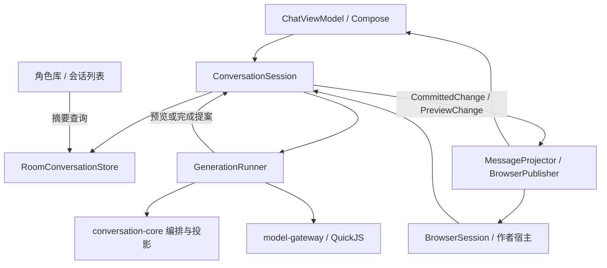

# 会话性能改造方案

日期：2026-09-14。状态：部分实施，整体架构仍为提案。依据：[性能调查与实验](performance-study-20260914.md)。现有生产行为仍由[架构](architecture.md)和[网页运行契约](web-runtime.md)描述。

2026-09-15 已实施正文解析复用、作者协调器增量接收、轻量页面配置、正则缓存和按条 token 预算；实际边界及验证见[性能改进记录](performance-improvements-20260915.md)。以下完整方案不代表全部已交付，尤其 Room、统一写入协调、流式事务和有界展示窗口仍未替换。

本方案选择：**单会话写入协调器 + Room 按单位存储 + 显式变化集 + 分离的流式预览与业务提交**。继续使用 Compose、单 WebView、作者协调 iframe 和现有 QuickJS 宿主，不新增顶层 Gradle 模块。

## 1. 目标与明确取舍

1. 输入草稿不遍历历史、不重新解析消息、不保存整段会话。
2. 流式更新只处理正在生成的候选及实际受影响的显示依赖；原始事件不能丢。
3. 角色库只读摘要；非活跃会话正文、检查点、历史生成计划不常驻内存。
4. 候选、状态、作者操作仍由一次持久事务确认，保留编辑、截断、恢复和资源固定版本语义。
5. 纯文本展示有界；已挂载 iframe 保留原生命周期。本次不自动休眠作者 JS，不承诺任意作者内容的内存有界。
6. 一次性完整作者数据加载仍可能与当前会话长度成正比，这是同步历史 API 的现有成本。消除的是此后每次变化的全量复制。

开发期允许替换旧内部 API；已经存在的聊天作为用户数据处理，一次性导入成功前保留原文件。方案内的数值是首版调度/容量配置，不是已测得的最佳值。

## 2. 模块与职责



| 组件 | 所属 | 职责 |
| --- | --- | --- |
| `ConversationSession` | app/conversation | 当前会话唯一写入口；命令排序、身份检查、状态机、提交、版本和任务生命周期 |
| `RoomConversationStore` | app/storage | 摘要、分页读、按单位事务写；不执行规则、脚本或网络 |
| `GenerationRunner` | app/conversation | 捕获一次生成输入；编排、Provider 校验、流接收、QuickJS 和完成处理；返回提案，不自行写会话 |
| `MessageProjector` | app/conversation | 按依赖失效，生成消息展示结果；限制并发，丢弃过期计算结果 |
| `BrowserPublisher` | app/conversation/web | 初始视图、增量包、接收确认与重同步；编码在后台，WebView 调用在主线程 |
| `ChatViewModel` | app/conversation | 将输入和操作交给 session，暴露输入、控制状态与消息窗口；不再维护第二个可写 record |
| `PromptCompiler`、操作 reducer | conversation-core | 纯 Kotlin 领域计算和不变量；不引用 Room、Android 或 WebView |

`ConversationSession` 随 ChatViewModel 保留当前会话，旋转不重新创建；进入另一会话先结束旧会话任务并完成保存，再交接。离开聊天界面释放 WebView/作者页面；已经进行的原生生成沿用当前 ViewModel 的生命周期，进程退出不保证继续，也不增加后台服务。最终销毁提供显式 `close()`，突然杀进程依靠已落盘进度恢复。

session 使用后台协程串行消费控制命令，事务期间只允许它改 head。耗时计算捕获不可变输入后在独立任务执行，网络等待不占据命令消费循环。结果携带 `sessionEpoch + generationId/operationId + basis` 回来，再检查是否仍有效。

控制队列首版 64 个待办，满时返回已有风格的忙碌错误；原生草稿使用一个“最新值”槽，不为每个按键堆积命令。取消先直接通知所属计算/网络任务，再由 session 串行收尾，不排在长模型请求后等待。任何异步完成回调都不能绕过 session 写数据库或 UI 事实。

## 3. 状态机、版本与操作冲突

会话阶段：`Opening → Ready → Preparing → Streaming → Finalizing → Ready`；保存失败进入 `StorageFailed`。作者持久操作与历史修改在 `Ready` 中串行处理；其他阶段只接受草稿、只读、取消和必要的内部结果。进入 `StorageFailed` 后停止新生成与作者写入，保留已提交事实及未保存输入，并提供重试保存/重新打开。

版本不再通过序列化整个会话计算：

| 标识 | 何时改变 | 用途 |
| --- | --- | --- |
| `sessionEpoch` | 新建运行实例/重新打开 | 淘汰旧 WebView、旧任务和旧调用 |
| `commitRevision: Long` | 成功提交业务事务 | 业务提案的乐观并发检查；与数据库写入在同一事务递增 |
| `draftSeq: Long` | 接受新的草稿值 | 输入同步和过期回显过滤；普通草稿自动保存不递增业务 revision |
| `streamSeq: Long` | 接收生成原始事件 | 预览、进度与最终输出的水位；归属 generationId |
| `viewSeq: Long` | 发布一份新的桥视图 | 传输顺序/失步检查；与业务提交数不必相同 |
| 程序/内容哈希 | 新内容产生时 | 来源绑定、blob 去重和缓存身份；不在按键热路径重算 |

首版业务操作全部检查 `commitRevision`；`send` 和依赖草稿的操作再检查 `draftSeq`，页面操作再检查 turn/variant 身份。流式预览和自动草稿保存不会让无关业务版本反复失效；生成期间的 busy 限制仍有效。暂不实现复杂的字段级并发合并。

作者队列上一项确认后，下一项用最新 revision 发送。回调型 updater 只执行一次；遇到版本冲突返回明确失败并同步当前事实，不自动再次执行有副作用的作者回调。原生正在输入时收到旧草稿确认，只更新保存水位，不覆盖更新的输入值。

同一 epoch 内请求使用 owner 归属、单调请求序号和请求 ID。保留最近结果供重复传输返回；结果已过期但序号已处理的请求只报告过期，不再执行。进程重启更换 epoch，不自动重发未确认作者操作或生成。

## 4. 存储结构

采用应用私有目录中的 Room 数据库，启用外键和事务。内容 blob 首版也放数据库，图片和既有网页资源继续使用文件仓库，避免聊天提交跨数据库/文件形成半成功。

以下为逻辑表，字段在实现时映射为 Room entity；所有所属关系建立索引，业务事务校验选中候选确实属于指定 turn。

| 表 | 主键及主要字段 | 写入时机 |
| --- | --- | --- |
| `character_summary` | assetId；名称、头像引用、sourceHash、manifestRef、资源状态摘要 | 导入、安装或角色元数据改变 |
| `conversation_summary` | conversationId；assetId、执行模式、创建/最近活动时间、turnCount、摘要预览 | 创建、结构变更、消息完成/编辑等实际活动 |
| `conversation_head` | conversationId；commitRevision、characterSnapshotId、personaId、runtimeCheckpointId、worldBookStateId、当前任务标识 | 业务事务 |
| `conversation_draft` | conversationId；draftSeq、savedText、choice/native draft 元数据 | 合并自动保存或操作提交 |
| `turn` | turnId；conversationId、position、role、selectedVariantId | 新消息、候选切换、结构操作 |
| `variant` | variantId；turnId、candidateOrder、messageId、source/canonical/reasoning blob 引用、状态、生成引用、编辑/开场/浏览器字段 | 本候选发生变化 |
| `variant_checkpoint` | variantId；before、projectionBefore、after、actionHead 等 checkpoint 引用 | 候选状态事务 |
| `runtime_operation` | operationId；所属 variant、状态、提交顺序与 checkpoint 引用 | Native/作者操作；保留现有逐次提交语义 |
| `generation` | generationId；所属 variant、模型/预设引用、evaluation context、usage、状态、输入快照引用 | 准备与结束 |
| `generation_message` / `generation_trace` | generationId + ordinal；role、origin、required、正文/diagnostic blob 引用 | 请求确定后、诊断产生后 |
| `stream_chunk` | generationId + seq；有序原始事件数据或连续同类文本批 | 流式进度保存 |
| `stream_progress` | generationId；persistedThroughSeq、projectedThroughSeq、最近 canonical 预览与临时投影状态 | 流式进度保存 |
| `content_blob` | kind + formatVersion + SHA-256；不可变 UTF-8/JSON bytes | 新文本、程序、角色/运行快照产生时 |

索引至少包括 `conversation_summary(assetId, lastActivityAt, conversationId)`、`turn(conversationId, position, turnId)`、`variant(turnId, candidateOrder)` 和各外键列。按稳定游标读取消息窗口；移动/删除历史允许在一次结构事务中调整位置，这是低频全量操作，不发生在流式更新中。

已完成消息正文直接引用 blob。source 与 canonical 相同则复用；生成计划中相同 prepared text 再次出现也复用。不同运行状态先保存完整不可变 blob，候选只保存引用；首版不引入 patch 回放链。哈希只对新产生的内容计算，编码后的 bytes 同时用于落库，不重复序列化。

完整生成诊断继续保留，但按需加载。相同正文得到去重，不保证完整请求的顺序/origin 元数据不再随轮数增长；保持精确历史请求本身有存储成本。孤立 blob 在会话操作稳定后按引用做分批回收，不在按键、流式或提交关键路径扫全库。

数据库列表 Flow 只观察 summary 表，输入和 stream 表变化不唤醒它。Room 的观察查询可能因同表其他行修改而重跑，结果使用 `distinctUntilChanged`，不依赖它提供单行精确失效。[Room 异步查询说明](https://developer.android.com/training/data-storage/room/async-queries)。

**明确的列表行为调整提案**：最近活动时间由消息、编辑、候选与持久业务操作更新，普通打字和中间流式保存不反复重排角色下的对话列表；保存时间另记在进度记录中。这一行为在实施时同步写入产品文档。

## 5. 读取、内存与接口

角色库通过摘要查询读取当前列表；完整角色 manifest 按进入详情/新建会话读取。预设仍保留现有资产格式，先改为异步初始化、按内容版本复用，避免本轮同时重建不相关的资产仓库。

打开聊天读取 head、persona/角色快照、当前状态、turn 身份索引和最近 50 条展示所需数据。旧生成计划和旧运行检查点不随消息列表一起加载；切候选/历史查看时按引用取得。正在使用的生成输入有独立生命周期，结束即可释放。

浏览器作者视图在后台另外读取该会话所有同步 API 需要的正文、候选、变量、世界书和程序；不加载 API 不需要的完整历史 Prompt/trace/操作快照。作者 bootstrap 完整后才启动后台程序及交互页面。可以先展示纯文本；发送和作者交互等到运行状态准备完成，渲染事实事件按原启动顺序交付。

接口草图只表示边界，不要求为每个名词建立框架：

```kotlin
interface ConversationStore {
    fun observeSummaries(characterId: String): Flow<List<ConversationSummary>>
    suspend fun open(id: String): SessionSeed
    suspend fun readMessages(id: String, cursor: MessageCursor?, limit: Int): MessagePage
    suspend fun readAuthorState(id: String): AuthorBootstrap
    suspend fun commit(id: String, expectedRevision: Long, mutation: ConversationMutation): CommittedChange
    suspend fun saveDraft(id: String, draft: DraftValue)
    suspend fun appendStreamProgress(id: String, progress: StreamProgressWrite)
}

interface ConversationSession {
    val controls: StateFlow<ChatControls>
    val draft: StateFlow<DraftView>
    val window: StateFlow<MessageWindow>
    suspend fun execute(command: ConversationCommand): CommandResult
    fun updateDraft(value: String)
    fun cancelGeneration()
    suspend fun close()
}
```

`open` 与 `readAuthorState` 读取同一个明确的 commit revision；初始化期间命令尚未启用，草稿预览另作 overlay。失步重建时通过同一 session 取一致快照，不能让多次独立查询混合两个 head。

首版不引入 Paging 作为网页桥依赖；使用 repository 的游标窗口，Native 和网页各自渲染。摘要列表如需要 Paging，可仅在 UI 适配层接入，不影响会话事务和作者同步 API。

## 6. 四条关键执行流程

### 6.1 打字

1. Compose 输入立即更新本地值，向 session 最新草稿槽投递值和客户端序号。
2. session 接受后递增 draftSeq，发布仅包含草稿的 `PreviewChange`；不访问 turn、正文或历史状态。
3. BrowserPublisher 合并草稿到达的最新值。主壳更新控件，作者协调器更新 draft 分支；正文 dirty 集合为空。
4. 首次 dirty 后 500 ms 触发保存，有后续变化则继续周期保存；这是节流，不等待停止输入。只更新 `conversation_draft`，失败保留未保存标识和值。
5. 发送、切会话、显式关闭时执行保存屏障；作者 `draft.replace` 属于显式持久操作，仍在保存成功后确认。

### 6.2 发送与流式回复

1. `Ready` 中检查 revision/draftSeq，捕获角色、世界书、选中历史、预设、模型、evaluationInstant/zone 和运行 head，进入 Preparing。
2. 后台执行用户输入投影；session 提交用户消息、相关检查点与草稿清理。编排在计算 dispatcher 执行，EJS 按顺序挂起求值，Provider 校验按需执行。
3. 确认最终请求，保存生成输入快照、计划、assistant STREAMING 候选及其状态引用，再启动 Provider 流。保持现有 `commitPreparedRuntime()` 边界：第一条 GenerationEvent 进入处理前，仅提交一次计划产生的 Macro/世界书状态；候选的 projectionBefore 引用该计划态。Assistant 预览产生的临时状态不提前替换当前运行 head。
4. 流接收器完整接收并编号原始事件，文本使用分块累积/StringBuilder，避免每个 token 复制全部已有字符串。接收与展示解耦；队列按条数和总字节数设有界背压，沿用现有响应大小限制，绝不丢弃 delta。
5. 每 50 ms 最多发起一次尾消息预览计算；任意时刻最多一个计算中任务和一个待计算的最新水位。慢计算不被每个 token 取消重启，完成后若已落后直接处理最新水位。
6. 预览使用固定的投影前状态和当轮求值上下文，产生 canonical/display/临时状态，带 generationId 与 throughSeq。它不执行 MVU 完成事务、不发布持久成功、不重放作者业务事件。
7. 每 500 ms 将未保存原始事件批量追加 `stream_chunk`，更新最新已有预览的 `projectedThroughSeq`。原始水位与投影水位分别保存，不用尚未计算的正文冒充最新投影。未完成回复不更新历史 variant 的全部字段。
8. 收到 Finished 只标记内容结束，接收端继续消费协议允许的尾部 usage/metadata，不能立刻关闭流；传输正常结束后进入 Finalizing 并保存剩余事件。等待/替代预览，执行完整最终投影、必要状态确认和一次 MVU 更新。session 提交正文、reasoning/signature、usage、状态和 head，在**同一事务**将 variant 标为 COMPLETE 并清理对应临时进度。之后发布完成事实并允许下一轮。

原始事件批可以合并相邻同类文本，但不得跨 reasoning/signature/finish 等边界重排。50 ms 的控制对象是展示任务；作者已支持的流式事件沿用其原有载荷与顺序，必须覆盖所有增量文本，不能因为屏幕上只画最新状态而漏掉事件。

收尾分类保留现有规则：MVU 必须收到受支持的正常完成原因，否则保持中断/失败且不更新 MVU；无 MVU 的正常 EOF、空正文和截断原因按当前 generator/core 的语义处理，不能统一凭一个 Finished 布尔值判断。结束标记重复时不重复执行状态事务，之后到达的用量仍完整计入。

任意 Regex/Macro 可能依赖全文，所以首版预览仍允许对**当前回复全文**重新投影；目标是减少次数并移出主线程，不虚构逐字符等价算法。正文源未改变而只有 reasoning 更新时，只有在依赖分析证明独立时才复用正文结果。

### 6.3 作者写入、切候选和历史操作

作者同步写入先在 JS overlay 更新相应变量/草稿，立即读可见，然后排队提交确定值。session 校验 owner、候选、revision 和 busy 状态，计算 mutation，提交后返回小型变化与确认。失败清除未确认 overlay，按现契约停止作者写入并显示已保存状态。

切候选事务同时改 selectedVariantId 和 runtime head；随后先使旧页面 owner 失效，再发布对应消息展示、变量及必要事件。历史“保存文字”只修改目标 canonical 与编辑标记；“从这里继续/重新生成”在单事务截断后续 turn、收敛候选并恢复 head。玩家世界书覆盖保留会话归属，不能因数据库拆表改成随候选回退。

Native handler 多次显式写入仍是多个提交：已成功的部分在后续失败/取消时保留，操作 checkpoint 与消息结束 checkpoint 分开。后台计算回来的提案若已过期，只能丢弃或明确失败，不得套用到新的候选。

### 6.4 取消、保存失败与恢复

- 取消先关闭 Provider/计算任务，随后根据已收到的原始事件完成中断投影：有正文则保存 CANCELLED，没有正文则移除空候选并允许重试，沿用现有行为。失败/取消保留最近已提交运行 head，不把预览临时状态当作完成状态，也不调用完整回复的 MVU 更新。Finalizing 中若完成事务已提交，取消不撤销完成事实。
- 进度保存失败：停止继续接受生成业务进展，保留内存中的未保存片段并报告；不发布 COMPLETE 或作者写入成功。恢复后从最后 durable 水位继续收尾，不能自动重发模型请求。
- 崩溃重启：启动摘要阶段只查询/标记遗留任务为 INTERRUPTED。打开该会话时读其 raw chunks 和最近投影；需要补投影时使用 generation 保存的预设、输入与求值上下文，只执行中断投影，禁止重跑 MVU 或作者操作。结果与临时数据清理同事务完成。
- 若所需旧程序版本或 bundle 不可用，保留 raw chunks 和最后已保存 canonical，明确报告无法补投影；不能用当前版本悄悄重放。
- 正常 500 ms 保存间隔不是硬性“最多丢 500 ms”保证，磁盘变慢时还包含排队和事务时间。记录 durable 水位，发送/切换/完成采用保存屏障，突然断电保证由实际数据库配置及设备验收确定。

## 7. 增量桥与作者会话

新内部协议命名为 `player-bridge-2`，与原生 APK 同步替换。对外作者 API 保持当前 profile，内部协议变更不伪装成新增作者能力。删除旧全快照差分路径后不长期维护两份桥实现。

初始包分为 `shell.bootstrap` 和 `author.bootstrap`。普通 frame.create 只返回身份、页面源码/引用、viewport 和会话引用，不再嵌入完整历史；作者协调器持有唯一数据视图，其他同源页面通过现有会话对象连接。

更新示意：

```json
{
  "type": "changes",
  "epoch": "session-instance",
  "baseViewSeq": 120,
  "viewSeq": 123,
  "commitRevision": 18,
  "patches": [
    {"kind": "draft", "draftSeq": 42, "text": "新的草稿"}
  ],
  "facts": []
}
```

patch 是内部强类型操作：draft、generation preview、message upsert/remove、variant selection、order splice、变量作用域替换、worldbook/program 变化、UI flags。顺序没有变化就不发送 order。变量首版允许替换整个受影响作用域，不要求识别任意作者对象内部的 JSON diff。

协议规则：

- 每个目标保留一个正在发送的状态包和一个待发送合并包；`baseViewSeq` 必须匹配接收方已应用序号，next 可跳号，但组合 patch 必须表达期间全部状态变化。
- shell 与作者协调器确认的是“状态已应用、事实已接收”，不等待 DOM 渲染或作者异步回调完成，避免回调等待生成而阻塞确认。
- `facts` 带唯一事件 ID 与顺序，可靠保存至接收确认，结果包和广播引用同一事件 ID，防止重复触发。只合并预览/可替换状态，业务事实不合并丢弃。
- 重复包不重放事实；旧 epoch 丢弃。序号失配暂停新作者写入并请求 bootstrap，保留已有页面对象和待确认请求的归属；无法恢复时才停止实例。进程重启换 epoch，不重放旧未确认业务。
- 大 bootstrap 分块准备、后台编码，所有分块组成同一个 revision 后再对作者启用；传输缓存有字节上限和背压，不在主线程构造巨型 JS 字符串。

作者协调器内部改为按 turn/variant、变量域、世界书索引的数据存储。base 只更新收到的分支；未确认写入使用按目标记录的 overlay，重建时只处理受影响目标，不再 clone 全部会话。API 返回的对象仍按契约复制，跨页面共享函数/对象注册仍保持真实引用。

`getAllVariables()` 等显式全历史查询依然可能是 O(N)，这是调用本身需要的数据范围；不能将其后台执行偷偷改成 Promise。优化普通更新不需要让所有作者查询都变成 O(1)。

shell 将“应用状态/接收事实”和“渲染”拆开。渲染只消费 dirty turn 集合，每帧处理有时间预算；一条旧消息没变，就不调用 Markdown lexer。尾消息反复变化只画最近的版本。迟到投影带旧候选/旧依赖版本时丢弃。

## 8. 展示缓存、窗口与脚本资源

`MessageProjector` 缓存键包含 message/variant 身份、正文版本、source 版本、Preset display 版本、角色规则版本、实际依赖的状态/变量版本及 depth。首版依赖分类为静态、深度相关、变量相关和未知；未知按规则变更/相关状态变更保守失效。只有无依赖命中的草稿变化才保证正文零投影。

每个已知完整投影的 Markdown 解析结果按 display 版本缓存。原生 `SafeMarkdownText` 使用相同来源版本规则缓存解析产物；Compose 拆分输入、控制栏、消息窗口的订阅，避免整个 ChatUiState 每次输入重建。

纯文本窗口首版最多保留 100 条可回收消息，初始加载 50 条，向前每批 50 条；读者位置用 turnId + 局部偏移锚定，缺失高度以已测值占位。对包含 iframe 的行先保留整个行及其实例，焦点所在行也固定，不把原 iframe detach 后再挂回导致重载。由于当前契约覆盖已挂载内容，首版对 static iframe 也采用保留策略；以后另行验证静态内容状态保存后再扩大回收范围。

因此总体挂载量为“普通文本窗口 + 已加载 iframe 行”，不会把它描述为所有卡片均有严格内存上限。作者页面暂停/恢复是后续独立能力，不作为本次完成条件。

QuickJS 首版复用不可变 bundle 字符串、程序指纹和已校验材料，继续每事务独立引擎。Native Surface 仅相关状态/草稿依赖变化时启动投影；采用一个运行任务加一个最新待办，减少无效取消。引擎池不属于本方案。

资源取得改造落在现有仓库：

- 按规范化 URL、固定内容哈希及显式 reprepare 批次合并在途请求；保留现有 6 路网页下载限制。网络等待移出角色/会话索引锁，同一角色的已存图片命中不等待整批准备完成。
- 提交索引前重新检查引用和配额，保持“文件成功保存且索引发布后才报告成功”。reprepare 完整版本集仍原子发布，不能把新旧混成一套。
- 热命中持有已验证 blob 元数据，以路径、长度、修改信息和本次进程验证记录判断是否需要再次完整校验；文件变化/缺失则重新校验或取得。读取失败的完整性诊断保留。
- 内置 APK 资源与改写结果采用按字节计量的 LRU；改写键为 contentHash + finalBaseUrl + parserVersion。可重建缓存首版总预算 16 MiB，单项过大则绕过缓存，不因此拒绝正常内容。原图/被引用网页依赖不计入此 LRU，也不能被其淘汰。
- 图片解码缓存另按显示尺寸与内容身份管理，先保证已有降采样继续生效；具体 native/GPU 内存预算通过真机数据确定，不与压缩文件大小混算。

## 9. Prompt 与 EJS 的具体改造

将 `GenerationPlanner.compile` 改为挂起函数，EJS renderer 改为 `suspend (EjsTemplateRequest) -> String`。沿实际调用链将需要模板的 entry preparation、世界书激活和编排方法改为 suspend；纯 Macro/Regex/token 计算仍为普通函数。`GenerationRunner` 在计算 dispatcher 调用编排，纯 Kotlin 测试通过协程测试入口执行。

模板在原有触发点 `await` 结果，返回后从该条目继续；删除 `EjsRenderRequired` 驱动的整轮重试循环。每轮缓存仍按完整请求上下文匹配；Provider 真正重裁剪时可重跑必要编排并复用模板结果，不能拿不同历史范围下的结果替代。

Token accounting 增加单条 prepared message 成本接口及一次输入的计数表。当前可加和计数器先算各项与 framing 常数，按原裁剪优先级扣减，最后整体验证一次；非加和计数器保留完整校验路径。世界书预算、required 项、预填充和 Provider 重裁剪规则不变。

Regex Pattern 缓存按展开后的模式、flags、兼容改写版本设上限；只缓存编译结果，不共享 Matcher、MacroTransaction 或随机求值。世界书先复用本轮扫描文本和已编译关键词规则，不引入新关键词引擎。

## 10. 旧数据导入与替换范围

采用一次性导入器，生产仓库不保留长期双写或双事实源。

1. 首次新版打开时创建新数据库并在后台逐份导入旧会话文件；旧 JSON、manifest、资源文件始终保留原位置与原 bytes。记录来源哈希和每份导入完成标记，失败可续跑。
2. 每份会话在事务中完整导入：ID、顺序、候选选择、正文/reasoning/signature、前后/head、操作、世界书覆盖、草稿、模式、生成诊断均保留。大文件完成后释放临时对象，不累计全库内存。
3. 读取新数据进行语义一致性比较；校验 turn/variant 数量、身份和所有持久字段，不只对摘要或原始 JSON 格式做比较。遗留 STREAMING 按原有中断语义处理，并在校验中明确允许这项恢复转换。
4. 全部可识别旧文件完成校验后，在数据库中写入激活标记，新运行路径只读写数据库。损坏文件明确报告并阻止静默遗漏，不能把解析异常吞掉当作空会话。
5. 原文件作为导入前备份保留，本次不自动删除。激活后新消息只存在数据库，不能自动回退到旧文件丢失新记录；数据库失败时进入恢复流程。

原子激活标记与全部会话导入完成状态同属数据库。崩溃后据标记继续导入或直接打开新仓库，不依赖一次跨文件 rename。导入期间展示进度并禁止修改同一数据集，不调用模型或执行作者程序。

需要替换/删除的旧生产路径：

| 当前代码 | 最终去向 |
| --- | --- |
| `ConversationRepository.loadAll`、完整记录 StateFlow、整文件 save | 摘要/窗口查询、按单位 store；旧解码仅保留在一次性 importer |
| `ChatViewModel` 中 record、updateVariant 全遍历、persist 调度及业务锁 | ConversationSession、GenerationRunner、store；ViewModel 留 UI 适配 |
| `toUiState` 内 BrowserProgramReader 和全快照生成 | 按内容身份准备程序、MessageProjector、BrowserPublisher |
| `BrowserConversation.revision(record)` | 显式版本；authorize 保留归属/候选校验 |
| BrowserSession 全快照构造后 diff、frame 持有完整 snapshot | bridge-2 typed changes、轻量 frame 配置 |
| shell 每包全行 render、session 全量 clone/rebuild | dirty 渲染和按目标 overlay |
| EjsRenderRequired 重编排循环 | 挂起编排与同轮结果缓存 |

## 11. 分批实施与验收

每批合并前都必须能独立运行；过渡适配只包旧 API，不引入第二个存储事实源，最后一批删除已替代路径。顺序以避免同时重写存储、并发和网页语义为目标。

| 批次 | 可交付结果 | 必须通过的验证 |
| --- | --- | --- |
| A | 补 trace；草稿订阅拆开；同步计算移出主线程；shell 跳过未变正文 | 原有功能回归；草稿解析 0 条；相同合成输入前后对比 |
| B | ConversationSession 接管全部写入，显式版本和 ChangeSet；暂接旧文件 store | 并发/过期结果、取消、作者确认、候选和世界书状态契约 |
| C | bridge-2、单份作者数据索引与 overlay、尾消息合并 | 跨页同步写后读、事件去重和顺序、丢包重同步、frame 不重启；Android 同源行为 |
| D | Room、摘要读取、按单位保存、完整旧数据导入 | 每类事务故障注入与进程恢复；字段级导入对照；草稿写入不触及历史表 |
| E | 挂起 EJS、token/Pattern 缓存、流式原始进度与最终事务 | 原最终正文/状态等价；原始流逐段保存；EJS 不因缺值重跑；usage/signature/取消恢复 |
| F | 纯文本窗口、资源锁/在途复用、bundle 缓存；清理过渡适配 | 滚动锚点/焦点、iframe 身份、资源版本、离线/损坏恢复及真机长运行 |

B 的旧文件 store 仍会整文件写，不能提前宣称解决存储问题；E 的按 chunk 保存依赖 D，不能在 B 用两个文件仓库模拟事务。

专项验收直接检查工作范围：草稿变化不读历史、不执行 Markdown；静态规则下尾回复更新不访问未变候选；非活跃会话不加载正文；列表不因 stream 表写入重查；终态事务前不得发布 COMPLETE；切候选必须同时匹配选中 ID 与 runtime head；失败后不得自动重发作者或模型请求。

绝对耗时、PSS 和耗电仍在目标真机上锁定基线；使用同样的 50/200/1000/5000 条历史、候选/变量规模和确定性流比较。性能断言优先使用调用数、读取行数、写入字节数、队列峰值和帧截止情况，不把桌面微基准的单次毫秒数写成 CI 门槛。

## 12. 本次设计交付边界

这份方案已选择存储路线、组件归属、版本规则、操作流程、内部桥协议、失败恢复和替换顺序，可以按 A–F 开始实施。目标设备的调优数值、作者页面休眠能力和历史诊断保留策略仍独立处理，不阻塞本方案其余工作。

本次只新增设计与导航链接；未实施表结构或生产接口，未运行新的性能/功能实验。上一轮探针结果属于研究文档所记录的运行，不能当作该新架构的测试结果。
