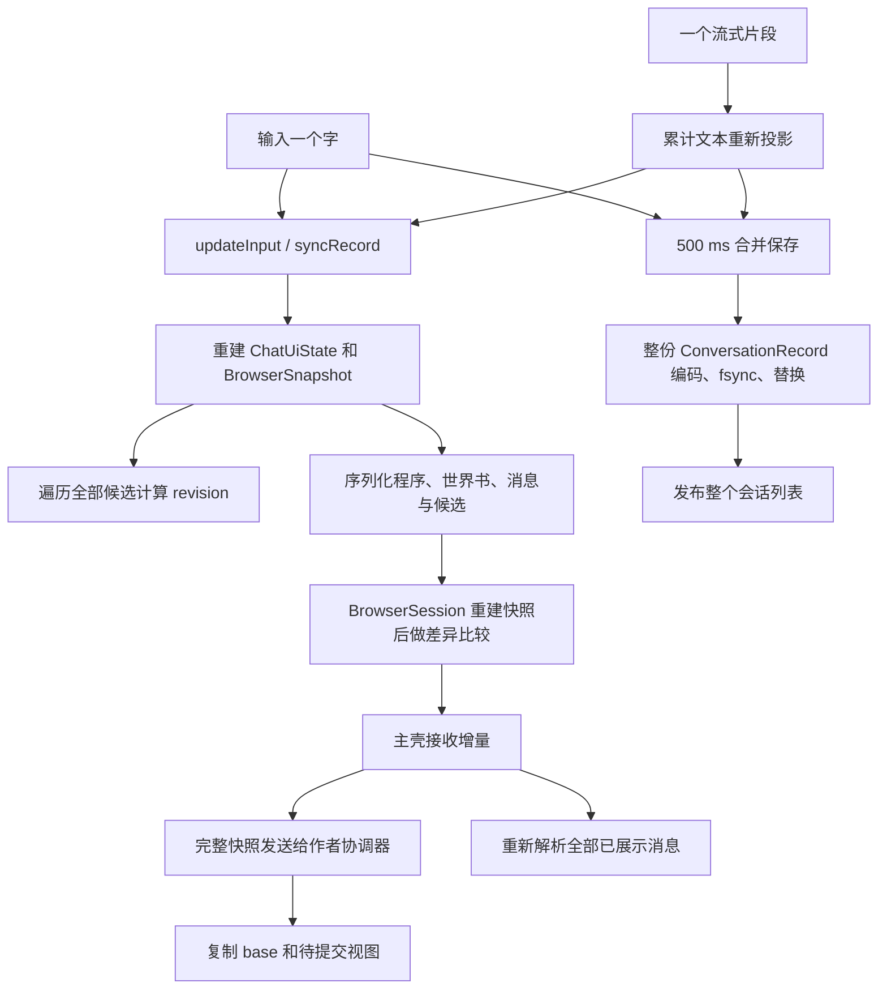

# 性能调查与设计方向

日期：2026-09-14。调查基线：`4bda47028bccd3d834895b0f6e62138eee81eba7`。

状态：研究与待讨论设计，未修改生产行为。覆盖启动、角色库、会话存储、输入、生成、展示、作者程序、资源及生命周期。当前契约仍以[架构](architecture.md)、[产品边界](product-direction.md)和[网页运行契约](web-runtime.md)为准。

研究后形成的具体实施提案见[会话性能改造方案](performance-design.md)。本页保留问题证据和当时的实验数据，具体组件与实施顺序以该方案为讨论入口。

## 判断

当前主要问题是**变化的粒度与处理的粒度不匹配**。输入一个字、收到一小段回复、修改一个变量，都可能触发整段会话的遍历、序列化、复制或展示投影。会话越长、候选越多、状态越大，几条路径会互相放大。

现有实现已经有后台 I/O、500 ms 持久化合并、50 ms 网页发送合并、片段复用、Regex 熔断和资源持久缓存。它们各自有效，但没有改变上游全量计算、全量会话存储、网页全量会话视图复制这三个规模问题。需要设计数据与更新边界，局部调低刷新频率不足以解决长期增长。

证据分为两类：下文源码事实可以直接确认执行方式；桌面合成实验可以确认规模趋势和重复次数。当前没有连接 Android 设备，尚不能给出手机上的耗时占比、掉帧率、PSS、发热或耗电结论，也不能把所有卡顿都归因于同一个热点。

## 1. 当前输入与流式链路



图中的流式投影已有 `Dispatchers.Default`，文件保存已有 `Dispatchers.IO`；这不意味着其余工作也已移出主线程。网页发送前的 50 ms 合并发生在 `ChatUiState` 和核心快照已经生成之后。

## 2. 分领域发现

### 2.1 启动、角色库与详情

- `ConversationRepository.init` 调用 `loadAll()`，反序列化所有会话的完整 JSON，并把全部 `ConversationRecord` 常驻在 `StateFlow<List<ConversationRecord>>`。角色库首屏为了显示对话数量，会在后台创建该仓库。因此读取已移出主线程，但启动工作量和应用常驻内存仍随**所有会话的总数据量**增长。
- `CharacterRepository.loadStorage()` 读取所有完整角色 manifest；已有 `manifestsById` 避免查询路径时重复解析，仍未分离角色列表摘要与角色正文。
- 每次保存会话都会过滤、追加、排序整个会话列表，再通知角色库订阅者。库页接收的是完整记录，而不是数量与最近活动摘要；具体 Compose 重组范围仍需测量，不能仅凭 Flow 发布就认定整页重绘。
- `PresetRepository` 在构造器同步读完整 manifest。`MainActivity` 通过按需 ViewModel factory 取用它，首次打开预设/聊天的调用路径可能在主线程触发这项读盘与解析。延迟创建与后台初始化是两件事。

源码：[ConversationRepository](../app/src/main/java/io/github/zvensmoluya/tavernplayer/conversation/ConversationRepository.kt)、[CharacterLibraryViewModel](../app/src/main/java/io/github/zvensmoluya/tavernplayer/characters/CharacterLibraryViewModel.kt)、[CharacterRepository](../app/src/main/java/io/github/zvensmoluya/tavernplayer/characters/CharacterRepository.kt)、[PresetRepository](../app/src/main/java/io/github/zvensmoluya/tavernplayer/presets/PresetRepository.kt)、[MainActivity](../app/src/main/java/io/github/zvensmoluya/tavernplayer/app/MainActivity.kt)。

### 2.2 会话文件与重复历史

- `save()` 对整个记录执行 `encodeToString`，再由 `AtomicFileStore` 写临时文件、`fd.sync()` 和替换。草稿与流式回复共用 500 ms 保存调度，修改量很小也会重写全部历史、角色快照、候选与状态。
- `MessageVariant` 内嵌 `generationPlan`；`GenerationPlan.messages` 保存当轮完整 prepared prompt，trace 也可保存正文。多轮 Prompt 反复包含相同历史，在历史尚未受上下文窗口限制时，累计保存量存在近似二次增长路径；达到固定窗口后不能继续按无限二次增长估计。
- 每个候选有处理前、投影前、处理后运行状态，还可有 `browserHead` 和操作检查点。内存中的对象引用可以共享，但 JSON 不保留这种共享关系。大型 MVU 数据会在文件中重复编码。
- 文件原子替换和先保存后确认承担了恢复正确性，不能为减少耗时直接删除。应改变写入单元，并保留提交边界。

源码：[持久化](../app/src/main/java/io/github/zvensmoluya/tavernplayer/conversation/ConversationRepository.kt)、[原子文件](../app/src/main/java/io/github/zvensmoluya/tavernplayer/storage/AtomicFileStore.kt)、[数据模型](../conversation-core/src/main/kotlin/io/github/zvensmoluya/tavernplayer/conversation/ConversationModels.kt)。

### 2.3 输入、状态派生与版本

- `updateInput()` 在网页模式每次调用 `syncRecord()`，而 `toUiState()` 会重建所有消息、重新读取 Preset 中的程序定义、编码角色程序和生成 `BrowserConversation.snapshot()`。
- `BrowserConversation.revision()` 序列化运行状态、世界书调整以及**所有候选**的消息和 head，再计算 SHA-256。草稿也属于哈希输入。显示一个草稿变化，要先处理远多于草稿的数据。
- `BrowserSession.snapshot()` 再遍历全部选中消息合并 display/reasoning；`sendSnapshot()` 再比较新旧结构，并在每个 delta 中传完整顺序。这里发送的是增量，但生成增量的成本仍是全量。
- 作者调用的授权、操作返回和部分 UI 同步也会重复生成 revision 或完整 snapshot。一次操作可能串联多次全量工作。

源码：[ChatViewModel 的 updateInput / syncRecord / toUiState](../app/src/main/java/io/github/zvensmoluya/tavernplayer/conversation/ChatViewModel.kt)、[BrowserConversation](../conversation-core/src/main/kotlin/io/github/zvensmoluya/tavernplayer/conversation/BrowserConversation.kt)、[BrowserSession](../app/src/main/java/io/github/zvensmoluya/tavernplayer/conversation/web/BrowserSession.kt)。

### 2.4 流式生成

- 每个 `TextDelta` 执行 `rawAssistant += event.text`，然后重新投影累计正文；`ReasoningDelta` 也走 `reprojectAssistantOutput()`。正文与 reasoning 的展示处理、规则执行、候选更新和 UI 派生都可能重复。
- `updateVariant()` 遍历所有 turn 和 variant。投影移到后台解决了一部分阻塞，但逐片段的累计文本处理量依然会增长；固定片段长度时，累计全文处理存在二次增长路径。
- `Finished`、MVU 完成及流收尾还会触发最终投影，不能把它们全部作为可丢弃中间状态。应先区分原始事件、预览和最终提交。
- SSE 网络读取已通过 `channelFlow` 在 I/O 上执行，不能声称“网络在主线程”。但下游串行处理很慢时，缓冲被消耗完后会产生背压，造成用户看到的生成速度落后于到达速度。

源码：[applyEvent / reprojectAssistantOutput / updateVariant](../app/src/main/java/io/github/zvensmoluya/tavernplayer/conversation/ChatViewModel.kt)、[SSE transport](../model-gateway/src/main/kotlin/io/github/zvensmoluya/modelgateway/transport/GatewayTransport.kt)。

### 2.5 Prompt、EJS、Token 与世界书

- `send()` 在 `viewModelScope.launch` 内直接调用同步 `projectUserInput()`；正常生成调用 `QuickJsEjsRuntime.compile()`，后者也直接调用同步 `compiler.compile()`。没有统一计算 dispatcher 边界，Macro、Regex 等待、世界书扫描和 token 计算会在这些路径上占用主线程。
- EJS 的挂起桥用 `EjsRenderRequired` 中断同步编排。每得到一个未命中的模板结果，再从 `compiler.compile()` 开始。缓存防止同一请求重复执行 EJS，却没有防止之前的历史投影、世界书扫描和模板前处理重复运行。若同轮顺序遇到 K 个不同请求，至少有初始编排及 K 次重新进入；条件变化和 Provider 重裁剪还可能增加次数。
- `ContextBudgeter` 先统计全体消息 token，之后每删除一条可裁剪消息，就重新统计剩余列表。大量历史超限时，计数器访问量存在二次增长路径。
- `CharacterRegexEngine` 有 4 个有界 worker 和 250 ms 单规则熔断，但每次运行仍会编译实际 Pattern，调用线程用 `future.get()` 等待。很多正常但较慢的规则也会累积延迟；单规则熔断不是一轮任务的时间预算。
- 世界书按扫描、递归、分组、概率、预算执行，关键词和正则可反复匹配。应先测条目数、扫描字节数和轮次，优先减少重复输入构造与编译，暂不把语义复杂的引擎替换为另一套关键词算法。
- 最终 Provider token 校验与路由尝试也是首字延迟的一部分。应分段计时，不能把请求发出前的本地计算、远程计数请求和模型首字等待合成一个“模型慢”。

源码：[QuickJsEjsRuntime](../app/src/main/java/io/github/zvensmoluya/tavernplayer/conversation/ejs/QuickJsEjsRuntime.kt)、[PromptCompiler](../conversation-core/src/main/kotlin/io/github/zvensmoluya/tavernplayer/conversation/PromptCompiler.kt)、[ContextBudgeter](../conversation-core/src/main/kotlin/io/github/zvensmoluya/tavernplayer/conversation/TokenAccounting.kt)、[RegexEngine](../conversation-core/src/main/kotlin/io/github/zvensmoluya/tavernplayer/conversation/RegexEngine.kt)、[WorldBookEngine](../conversation-core/src/main/kotlin/io/github/zvensmoluya/tavernplayer/conversation/WorldBookEngine.kt)、[ConversationGenerator](../app/src/main/java/io/github/zvensmoluya/tavernplayer/conversation/ConversationGenerator.kt)。

### 2.6 网页展示、协调器与队列

- `shell.apply()` 接收 delta 后，仍向作者协调器 `postMessage` 完整 snapshot。`session.receive()` 复制一次 `base`，`rebuild()` 再复制一次视图，使用 JSON stringify/parse，并通知所属页面。已有共享作者会话避免每页维护独立业务状态，但仍有整份视图的复制。
- 每个 packet 都进入 `renderQueue.then(() => apply(packet))`，没有在 JS 队列中合并过时展示请求。渲染速度落后于进入速度时会排队，原生 50 ms 合并不能保证浏览器处理得过来。
- `render()` 遍历全部已展示消息，`renderRow()` 每次都调用 `segments()`，重新运行 Markdown lexer/parser；段 key 比较发生在解析之后。未变化的 iframe 通常确实复用，但仍支付遍历与解析成本。
- 初始 50 条；点击向前加载增加 50，新消息也增加 `shown`，所以长时间聊天和查阅历史会持续增加挂载量。这是逐步展开，不是有界窗口。
- `BrowserSession.createFrame()` 为每个 frame 生成初始 snapshot 并保存在 frame 配置中。配置又进入父页面文档。大历史与多个页面组合有额外驻留和启动复制成本，需要 Android/Chromium heap 核查实际保留关系；不能简单认定每个对象都完全独立或已经泄漏。

源码：[shell.mjs](../tools/web-runtime/src/shell.mjs)、[session.mjs](../tools/web-runtime/src/session.mjs)、[parent.mjs](../tools/web-runtime/src/parent.mjs)、[BrowserSession](../app/src/main/java/io/github/zvensmoluya/tavernplayer/conversation/web/BrowserSession.kt)。

### 2.7 QuickJS 与可选 Native 路径

- EJS 每次模板求值新建线程、引擎并装载 bundle；MVU 每次事务重建引擎，读取 bundle、构造卡程序并加载；Native Surface 每次投影/操作创建新引擎和模块。
- 输入变化还会调用 `refreshNativeSurfaces()`；适配含脚本且 revision 改变时，会取消旧投影并启动新投影。适配分支需单独统计计算次数、取消浪费与引擎启动耗时。
- 这些一次性引擎承担了跨卡、候选、失败和取消后的隔离，不能直接换成跨会话全局引擎池。第一步可缓存不可变 bundle、解析资料与指纹；引擎复用需要独立的状态重置与失败销毁验证。

源码：[MvuConversationRuntime](../app/src/main/java/io/github/zvensmoluya/tavernplayer/conversation/mvu/MvuConversationRuntime.kt)、[QuickJsMvuRuntime](../app/src/main/java/io/github/zvensmoluya/tavernplayer/conversation/mvu/QuickJsMvuRuntime.kt)、[QuickJsNativeRuntime](../app/src/main/java/io/github/zvensmoluya/tavernplayer/conversation/script/QuickJsNativeRuntime.kt)。

### 2.8 图片、网页依赖、原生排版与后台行为

- 图片原件已有持久保存，头像导入和资源缩略显示已有降采样，不应笼统归因为“所有图片都原尺寸解码”。仍应测多图场景的解码次数与缓存命中。
- `CharacterImageRepository.prepare()` 持有角色锁完成整个串行下载循环；同一角色的网页 `resolveForWeb()` 也需要该锁，慢资源准备会阻塞该角色正在显示的图片取得。网页命中图片时先读文件做哈希，随后响应路径再次读取文件。
- `WebResourceRepository` 已有 6 路下载限制、内容哈希复用、版本固定和 last-use 批量保存。热命中仍解析会话索引、整块读资源并校验哈希；部分路径读取全局索引。新资源取得未按 URL 合并在途请求，锁外下载可能重复，重定向脚本/CSS 还可能重复启动 QuickJS 做改写。
- WebView 响应标记 `no-store`，内置资源 `BrowserEnvironment.asset()` 每次重新读 APK assets。是否引入内存缓存及安全的缓存头应按不可变资源身份分别处理，不能打破会话固定版本。
- Native 消息已有 `LazyColumn`，但 `SafeMarkdownText()` 每次实际重组都会重新 sanitize/parse，没有按 source 保存解析结果。这里的收益需要通过实际重组次数衡量。
- WebView 的 `onPause/onResume` 和退出时 `destroy` 已接入；不能从这一点推断所有作者定时器、网络和后台计算都暂停。需要覆盖退后台、停留其他页、恢复、退出对话后资源释放，以及 WebView renderer 退出。当前证据只支持“待测”，不支持“已发生泄漏”。

源码：[CharacterImageRepository](../app/src/main/java/io/github/zvensmoluya/tavernplayer/characters/CharacterImageRepository.kt)、[WebResourceRepository](../app/src/main/java/io/github/zvensmoluya/tavernplayer/conversation/web/WebResourceRepository.kt)、[BrowserEnvironment](../app/src/main/java/io/github/zvensmoluya/tavernplayer/conversation/web/BrowserEnvironment.kt)、[SafeMarkdown](../app/src/main/java/io/github/zvensmoluya/tavernplayer/conversation/SafeMarkdown.kt)、[WebMessageView](../app/src/main/java/io/github/zvensmoluya/tavernplayer/conversation/web/WebMessageView.kt)。

## 3. 本次规模实验

使用[独立探针](../tools/web-runtime/performance-probe.mjs)，直接调用生产 `createSession()`，并在内存构建的生产 shell 中加入解析次数计数和队列排空观测。没有更换渲染算法或修改生产 bundle；原生桥由本地桩响应，全部资源本地提供，没有模型调用或社区素材。

环境为 Windows x64、Node `v22.14.0`、Headless Edge `153.0.4234.32`。每条合成正文 2,080 个 ASCII 字符，只有一个候选；snapshot 保留生产形状中的正文、sourceText、display、swipes 等重复字段，变量组在 data 和 swipes_data 中各包含一个 4,096 字符值。未加入世界书、真实作者程序、复杂候选和大型脚本，不能视为这些场景的上限。

### 完整作者会话接收，仅改变 draft

每组预热 5 次，采样 20 次；计时包含 `receive()` 内的复制和视图重建，不包含原生编码、跨 frame 传输或 DOM 展示。

| 消息数 | 每条变量字符数 | JSON 快照字节数 | p50 | p95 |
| ---: | ---: | ---: | ---: | ---: |
| 50 | 0 | 447,020 | 3.4 ms | 5.7 ms |
| 200 | 0 | 1,787,970 | 14.8 ms | 17.5 ms |
| 1000 | 0 | 8,940,770 | 82.1 ms | 138.0 ms |
| 50 | 4096 | 856,620 | 7.9 ms | 11.4 ms |
| 200 | 4096 | 3,426,370 | 30.7 ms | 47.3 ms |
| 1000 | 4096 | 17,132,770 | 161.5 ms | 227.0 ms |

### 真实 shell 接收增量

先预热 5 次草稿 delta，再测 10 次。每个草稿 delta 的变更消息数组为空。最后连续投递 20 个尾消息增量，检查累计解析量；这是排队行为探针，未模拟原生 50 ms 节流或真实 Provider 到达节奏。

| 总消息 / 已展示 | 每次草稿 delta 的 Markdown 解析次数 | 草稿 shell p50 | 20 次尾消息更新的解析总次数 |
| --- | ---: | ---: | ---: |
| 50 / 50 | 50 | 21.4 ms | 1000 |
| 200 / 50 | 50 | 23.1 ms | 1000 |
| 1000 / 50 | 50 | 38.0 ms | 1000 |
| 200 / 200 | 200 | 62.5 ms | 4000 |

shell 计时到自身 renderQueue 排空，不等同于帧上屏完成，也不等待协调器所有异步消息完成；不能与上表的 Node 时间直接相加。小样本分位数会受 GC、调度和机器负载影响，最稳固的结论是**仅改变草稿仍解析全部展示消息，连续更新没有在 JS 展示队列合并，完整视图复制随总数据量增长**。

## 4. 建议的设计边界

### 4.1 单个会话的写入协调与不同读模型

将会话操作集中在单个写入协调器：检查操作归属 → 根据捕获输入计算提案 → 持久化提交 → 发布带版本的变化。UI、网页桥与脚本宿主消费结果，避免各自维护一条可写时间线。这里不要求建设通用事件溯源框架。

读模型至少区分：角色/会话列表摘要、当前会话的运行状态、展示消息窗口、作者可同步读取的会话视图、单轮生成输入。它们各自有不同的数据范围和更新频率。

权威修改采用单调递增的提交版本，版本更新与数据提交在同一事务中完成；网页 epoch 和 turn/variant 身份继续验证。草稿预览、流式预览有独立的序号与合并机制，不能把尚未持久化的数据伪装成提交完成。内容哈希继续用于角色来源、程序和资源身份，退出每次输入的 revision 计算。分域版本是否允许更细并发检查，待操作冲突表确定，不能仅把 SHA 换成一个未覆盖所有写入的计数器。

### 4.2 按变化单位持久化

建议以 SQLite/Room 为首选验证方向：列表摘要可以索引查询，消息、候选、草稿、操作和检查点能按单位更新，提交与 head 切换可以形成事务。相较继续拆零散 JSON 文件，它能减少自行实现跨文件一致性和索引恢复的工作；这是基于本仓库需求的设计判断。Room 支持挂起与 Flow 查询，但观察查询仍须控制失效范围和结果去重。[Android 官方异步查询说明](https://developer.android.com/training/data-storage/room/async-queries)。

建议的数据单位：

| 单位 | 需要解决的问题 |
| --- | --- |
| Conversation summary | 角色关联、标题/预览、时间、消息数、执行模式；列表不读取正文和检查点 |
| Turn / Variant | 稳定身份、顺序、选中候选、正文、reasoning、状态；单条变化只写相关记录 |
| Runtime checkpoint / operation | 候选和操作 head 显式引用不可变检查点；相同快照复用，保留原有恢复语义 |
| Character / program snapshot | 不可变部分共享；会话作者改写世界书、Regex、变量时形成会话自己的版本，不能回写角色资产 |
| Generation record / diagnostics | 轻量 metadata 常驻，完整请求与 trace 按需读；重复文本内容可去重 |
| Draft / stream progress | 独立保存，避免输入和流式进度重写历史 |

只把整份 `ConversationRecord` JSON 放入一列仍然保留主要问题。检查点先做完整快照去重，再用数据决定是否引入 patch 链；不要一开始建立无限回放链。完整 Prompt/trace 是否需要长期保留全部轮次是独立产品取舍，本轮不擅自删除历史诊断。

持久化需定义：普通草稿与未完成流可丢失的最长间隔、完成状态何时 durable、作者写入何时确认、失败/取消后的 head。先保留现有语义，改进写入范围，再讨论频率。虽然项目允许开发期不兼容重构，已有实际聊天仍可能是用户数据；落实存储改造时需要备份、旧格式一次性导入和数量/候选/head 校验，不能直接清空私有目录。

### 4.3 从数据源到浏览器的增量更新

- 捕获稳定输入后在计算 dispatcher 上执行 Macro、Regex、Prompt、token、哈希和 JSON 准备；主线程只做轻量状态发布及 WebView API 调用。
- 接收流式事件用有界队列和累积缓冲，保留所有原始文本、reasoning、signature、usage、完成与失败事件。合并的是派生展示任务，不能丢 Provider token 或业务事件。不要对长流使用只有静默时才触发的 debounce。
- 显示按一段时间内最新预览投影；最终收尾执行完整权威投影和状态事务。不能假定任意 Regex/Macro 都能逐字符增量运行；跨文本匹配、宏副作用及 MVU/EJS 仍需保留既定求值边界。
- `ChangeSet` 显式指出草稿、正文、候选、变量、顺序、规则等变化；初次进入与失步恢复才发全快照。顺序不变时不重复发送全部 ID，带 base/next version 检测丢包和乱序。
- 作者协调器对 base 与待提交视图应用变化，复制需要防御性隔离的分支；共享对象、同步事件、立即写后读及写入失败恢复仍按当前契约。
- shell 按脏消息渲染，草稿不重新解析正文，静态 Markdown 结果按内容版本缓存；JS 端采用一个运行中和一个待处理展示任务，合并尾消息预览。状态事实和生命周期事件单独可靠处理，不能随渲染合并丢失。
- display 缓存键必须覆盖实际依赖：正文/source、候选变量、当前 Preset display 规则、角色规则、深度、相关运行状态等。追加消息会改变 depth，不能认为旧消息显示永远不受影响；未知依赖允许扩大失效，先保证语义正确。

### 4.4 展示窗口与作者运行时分别管理

普通文本和 static HTML 可以先用稳定锚点、测量高度和预取范围管理有界展示窗口；图片延迟解码，避免展开历史后一直增加布局工作。Native `LazyColumn` 与网页窗口应共用消息身份，而不是强求同一种实现。

有两个不能绕过的约束：

1. 当前网页契约明确保证已挂载作者页面不会因为滚动或追加消息而被销毁重跑；销毁会影响闭包、监听器、共享注册、表单状态和等待中的操作。第一步保留这些页面的生命周期，可以测量跳过不可见绘制/布局的收益，但不能据此承诺 JS 内存有界。
2. 作者同步接口可能读取整个历史、其他候选或世界书。显示只保留 50 条，不代表作者数据也能只保留 50 条；任意按需数据库请求不能无声变成同步 API 的异步行为。近期可保留完整作者数据视图、只增量更新；其首次加载与常驻大小仍是成本，需要独立预算。

若要进一步限制活跃作者页面数量，需要单独讨论暂停/恢复契约、可序列化状态范围和超预算行为，并更新兼容文档。不能用“虚拟列表”一词掩盖这项产品变化。

### 4.5 编排和资源的后续优化

- EJS 从“缺结果就重新编排”转为可挂起的顺序编排，或保存明确的编排阶段状态。不要提前执行所有模板：只有真正激活的模板应在原有顺序求值，随机、Macro 事务、扫描与预算必须保持一致；同轮 Provider 重裁剪继续复用合法结果。
- 对当前可加和的本地计数器缓存每条 prepared message 的 token 成本，裁剪时扣减并保留最终校验；不假定任意 Provider 序列化后的计数都可直接相加。
- 静态 Pattern、规则预处理、不可变程序与 bundle 采用有容量上限的缓存；动态 Pattern 以实际展开后源码和 flags 为键，不缓存交易中的 Macro 结果。
- 图片/资源以 URL 或内容身份合并在途取得；锁只保护索引/状态提交，网络等待不占角色总锁；磁盘流与已验证 blob 减少重复整块读取。完整性校验时机、文件变化检测、失败恢复和资源固定版本需一起验证。
- 建立原件持久数据、可重建缩略图、解码缓存、网页依赖 blob、改写产物的不同配额与生命周期。原图和被会话引用的依赖继续受保护，不能作为一般 LRU 自动删除。

## 5. 测量与实施顺序

先建立操作到上屏的分段计时，至少包含：启动索引/加载、用户输入接收、状态派生、Prompt/世界书/EJS/token、Provider 校验与请求、首个网络片段、预览投影、原生桥字节量/编码时间、shell 队列等待/解析/布局、保存字节数与 fsync、引擎装载/执行，以及资源查找/下载/改写。只记录阶段、耗时、大小、计数和匿名标识，性能记录不需要聊天正文或凭据。

Android 以接近 release、非 debuggable 且 profileable 的构建测启动、输入、滚动和完整发送场景，使用 Macrobenchmark 与 trace 定位主线程任务；小型计算另外测耗时和分配。官方资料区分宏观用户操作与小块代码测量，且强调基准构建应接近生产配置。[Macrobenchmark](https://developer.android.com/topic/performance/benchmarking/macrobenchmark-overview)、[Microbenchmark](https://developer.android.google.cn/topic/performance/benchmarking/microbenchmark-overview?hl=en)。网页同时检查 JS heap、DOM、监听器、detached 节点和 GC；应用进程与 WebView renderer 的内存要分别观察。[Chrome 内存诊断](https://developer.chrome.com/docs/devtools/memory-problems)。

建议规模矩阵按维度分组测试，而非一次跑完整笛卡尔积：

| 维度 | 建议样本 |
| --- | --- |
| 角色/会话库 | 10、100 个角色；10、100、500 个会话；摘要相同但历史体积不同 |
| 当前历史 | 50、200、1000、5000 条；正文 0.5、2、8 KiB；候选 1、5 个 |
| 结构化状态 | 空、4 KiB、64 KiB，另测接近接口上限的单个压力案例 |
| 生成与规则 | 确定性流 10/30/60 次更新每秒；纯文本、display Regex、EJS/MVU 分开 |
| 内容展示 | 文本、static HTML、多交互页面、大图、重复依赖；初次展开与反复滚动 |
| 生命周期 | 冷/热进入、旋转、键盘、前后台、取消、候选切换、保存中断、进程恢复、renderer 退出 |

先采用复杂度与正确性验收，再根据目标手机锁定绝对预算：

- 只改草稿：历史 Markdown 解析次数为 0，不编码未变化历史、不重写历史持久数据。
- 更新尾消息：只处理受影响显示依赖；长历史不能让每次更新强制复制全部会话。允许依赖变化导致明确的批量重算。
- 列表首屏：不反序列化所有会话正文/检查点；非活跃会话不会仅因显示数量而全部常驻。
- 单条保存：写入量与变化记录/检查点有关，而非与整段会话等大；重启、候选和写入确认语义保持一致。
- 单轮 EJS：命中模板结果不再导致从头重放整条编排；裁剪不对所有保留消息反复做相同 tokenization。
- 文本窗口和展示待办有界；作者程序生命周期与同步数据限制单独列出，不能把这两项也标为自动有界。
- 真机输入延迟、首字可见延迟和掉帧率按 p50/p95 报告；在 60/120 Hz 下分别检查帧截止时间，并测稳定运行及退出后内存趋势。暂不在没有目标设备基线时承诺某个整体毫秒数或优化倍数。

建议推进顺序：

| 顺序 | 交付内容 | 为什么在此时做 |
| --- | --- | --- |
| 1 | 分段 trace、确定性输入/流、规模夹具；完整计算移出主线程；草稿不触发正文解析 | 先获得可比较基线并切断明确的不必要工作 |
| 2 | 会话写入协调、版本与变化集；逐条投影、桥与作者会话增量、展示队列合并 | 解决每次小变化放大为全量计算的问题，保留既有持久化边界作过渡 |
| 3 | 摘要索引与按单位存储、诊断按需加载、检查点引用；旧数据导入验证 | 同时降低启动、常驻内存和保存写放大；不保留重复的长期事实源 |
| 4 | EJS 编排续行、token/规则缓存、资源取得和静态展示窗口 | 处理发送前计算及内容复杂度成本；以测量决定各子项顺序 |
| 独立决策 | 作者页面暂停恢复与内存预算 | 涉及可观察程序生命周期，不能夹带在普通展示优化中 |

Baseline Profiles、R8 和局部 Compose 优化可在基准构建中验证，但它们不能替代上述数据量与更新范围设计。当前没有证据需要更换默认单 WebView 架构，也没有证据需要重写整个项目。

## 6. 本次交付与验证范围

新增研究文档与 `tools/web-runtime/performance-probe.mjs`，更新文档导航；没有生产 Kotlin/JS 行为变更，没有创建提交。

本次执行：

```powershell
# 在 tools/web-runtime 下
npm run build
node performance-probe.mjs
```

探针结果写入忽略目录 `tools/web-runtime/build/performance/probe.json`，包含基线 commit、实际 shell/session 源码 SHA-256、运行时版本、样本量与原始汇总。表格记录的是 2026-09-14T03:40:27Z 开始的成功运行；早期探针因传入浏览器响应的二进制类型不正确导致导航超时，修正探针为 Buffer 后全部四组浏览器案例完成，不属于应用性能失败。

`adb devices` 没有列出设备，未运行 Android 性能、生命周期、PSS 或耗电测试；也未运行真实 Provider 或社区卡长对话。没有改动 Android 生产代码，未运行 Gradle 全量测试、APK 构建或 lint。桌面探针只作为设计证据，不新增 CI 时间阈值。

另已通过 `node --check tools/web-runtime/performance-probe.mjs`、`git diff --check` 和上述三个 Markdown 文件的本地链接检查。
